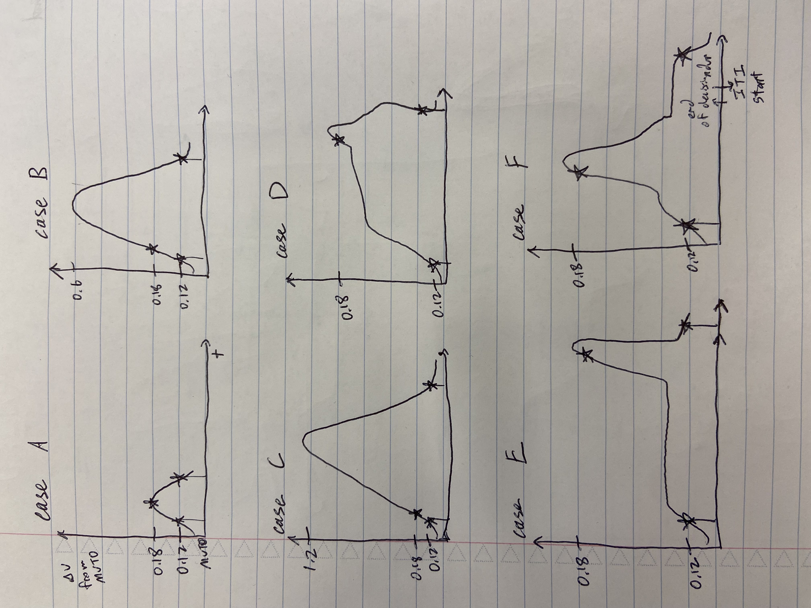

# PreprocessLeverData
The lever data, `leverdata`, only holds the raw lever Arduino values from Arduino's `readAnalog()` function, which scales 0-5V (the voltage range going into this pin) to numbers from 0-1023 (so at a resting neutral position, the lever is usually about 550 which anecdotally seems to match Vincent's calculated Voltage of about 2.6V). The Arduino encodes these numbers with values between 0-1023 into 2 bytes of data and sends them over to the computer via USB virtual serial port. The MATLAB program, leverIN_to_matlab.m then listens in and decodes this array of 2 bytes back into the number between 0-1023 and saves it into `leverdata`.

__Additional information on the sampling rate__: It's a more or less consistent sampling rate because the number of data bytes actually being sent through the USB virtual serial port is always exactly 2 bytes. Empirically, it varies, for the first few thousand entries it'll be a little faster ~100us, then for whatever reason it slows down to a more consistent pace of around 150-170us, probably due to hitting/overloading the serial port transfer buffer limit (in the Arduino code, there is no delay, it sends new data as soon as it has read it and reads new data as soon as it's done sending). Since it's so fast, but also empirically quite consistent after the first few thousand entries, I've decided to let go of trying to get it at an exactly even sampling rate since I believe at these several kHz frequencies, the actual animal movements will be approximated closely enough for analysis and comparisons. Plus, sending additional bytes of information (e.g. exact time) through the USB serial port will only slow it down further.

Also, anytime a trial is not currently ongoing--which is when we are in the ITI--so when tStart == LOW or 0V is at the tStart pin (pin 11), `leverdata` will be >2000. First, we will align each trial's MATLAB starting time to each first value of `leverdata` that is not >2000. Dividing the total time between trial start times by the number of entries recorded in `leverdata` between those two points will give an estimate of the sampling frequency and the change in time, `dt`, between any two entries for that trial.

The sensor itself may have some noise above a cutoff frequency, `cutoff_frequency`, of 40 Hz and all relevant attributes of the animal's movement are below 40 Hz. We'll use a sharp 6th order Butterworth filter to filter this out.

Finally, we'll rescale everything from the 0-1023 Arduino values range back to the 0-5V range: $\text{data} \times \frac{5}{1023}$, and save it as `processed_leverdata`.

All data will be saved as .bin files in case I need to go back to C++ in a folder specified by `output_folder`

## This book analyzes 1 day session.

## Requires:
- ToneDisc matfile
- LeverData matfile

## Outputs to folder:
- full.bin as the full raw `leverdata` Arduino values for the entire session
- trial#.bin files as the raw `leverdata` Arduino values
- filtered_trial#.bin files as the low-pass Butterworth filtered Arduino values
- processed_trial#.bin files as the converted voltage values of lever data
- sample_times_trial#.bin files as the aligned time values for each sample
- trial_frequencies.bin as the estimated sampling frequency for each trial
- tone_indices.bin as the sample index values for tone times for each trial
- leverpress_indices.bin as the sample index values for leverpress times for each trial

# PreprocessDataArduino
This is just a histogram of the previous old `dataArduino`'s sampling rate, as defined by the difference between MATLAB times between every two consecutive samples.

This `dataArduino` only adds samples in between running sections of the trial code throughout the main MATLAB ToneDiscriminationV3_GF.m code, leading to very uneven sampling, and it also sends several other bytes of irrelevant information each time (e.g. empty left and right lickspout detection data) which further slows it down.

## Not used in main analysis anymore.

# HitMovements
TODO: put back valueerror in extract_leverpresses.py and make it impossible to not be below first threshold within a trial

I will define a `movement` as the recorded lever movement between a defined first to second threshold and back for the third threshold. This notebook is solely for detecting and saving each movement from a day.

__Note on possible movements:__

This image lists some of the possible cases that could occur with movement. For our analysis, all of these movements will count. The first, second, and third thresholds are marked with stars, and the beginning of the movement window and ending of the movement window are marked with vertical lines.

The folder defined by `analysis0_folder` needs contain the processed `leverdata` as processed_leverdata_trial#.bin binary files. The extracted hit movements will have MVT0 subtracted off and be temporally aligned to be comparable. They will be saved to a movement_trial#.npy file also in the folder defined by `output_folder`. From this point forward, I'm using `np.save()` to save all analysis as 2D arrays since I'm assuming I don't need to reaccess or further process the entire giant data with C++ anymore.

## This notebook analyzes 1 day session.

## Requires:
- ToneDisc matfile
- **PreprocessLeverData** output

## Outputs to folder:
- movement_trial#.npy for each extracted hit movement

# Path
There are two parts to how a movement between point A and point B might vary. The first is variance in the actual movement path taken to get from point A to point B, and the second is the speed of the movement. Here, I'll analyze the movement path variance, `var_p`, across all __Hit__ trials that successfully have movement from the first threshold to the second threshold and back to the first threshold (this back threshold will effectively be a third threshold) from 1 day (and ignore variance in speed for now).

Then the movements will be scaled across % completion of their entire movement path. This percent completion movement will be saved again in `output_folder` as a movement_percent_scaled_trial#.npy file.

I will then plot the variance of this path, `var_p`, over the % movement completion between the first to second to third threshold. I also calculate the average movement path, `mean_p`, for __Hit__ trials that had movement from the first to second to third threshold for this 1 day. Finally, I will save `var_p` and `mean_p` to .npy files.

## This book analyzes 1 day session.

## Requires:
- ToneDisc matfile
- **HitMovements** outputs

## Outputs to folder:
- movement_percent_scaled_trial#.npy of the movement data scaled between 0 and 100%
- mean_p.npy of E[paths]
- var_p.npy of Var[paths]
- num_movements.npy an integer of the number of movements extracted

# CumulativePathVariance
To compare the movement path variance, `var_p`, across days, I calculate the cumulative movement path variance, `cumuative_var_p`, as the sum of the variance across 100% of the movement: $\int\limits_{0}^{100} Var_p(p) dp$ where $p =$ % movement completed. Then, I plot the cumulative movement path variance for each day.

### This book analyzes all sessions for an animal.

### Requires:
- **Path** outputs for all sessions for an animal

### Outputs to folder:
- cumulative_var_ps.npy the cumulative Var[paths] for each day

# Speed
As previously explained, there are two parts to how a movement between point A and point B might vary. The second part is the speed of the movement. Here, I calculate the average speed, `s`, of each __Hit__ trial's movement, defined as $\frac{100}{\text{time}}$ in units of % movement/s. I then find the mean of these average speeds, `mean_s`, and variance of these average speeds, `var_s`, across all trials for the day.

### This book analyzes all sessions for an animal.

### Requires:
- **HitMovements** outputs for all sessions for an animal

### Outputs to folder:
- mean_ss.npy the mean speed of movement completion across days
- var_ss.npy the Var[speed] of movement completion across days

# Velocity
Find the velocity path of movements. Velocity is calculated as the difference of consecutive points with a moving average filter of about 5 ms (~29 samples usually).

__cutoff frequency of a moving average filter__:
for a moving average filter, $H(w) = \frac{1}{N} | \frac{\sin(wN/2)}{\sin(w/2)} | =0.5= -3 \text{dB}$

where $w = 2\pi \frac{f_\text{cutoff}}{f_\text{sample}}$ and $N=$ num samples per window

This analysis requires 7.5ms of trial data before the actual movement to find the moving average. We are assuming reaction time after tone is always more than 7.5 ms.

## This notebook analyzes 1 day session.

## Requires:
- ToneDisc matfile
- **PreprocessLeverData** output (for trial frequencies)
- **HitMovements** output

## Outputs to folder:
- velocity_trial#.npy velocities (filtered with moving average) for all trials
- velocitymovement_trial#.npy velocities for the interval of hit movements only
- velocitymovement_percent_scaled_trial#.npy velocities % completion scaled for the interval of hit movements only

# Jerk
TODO: normalize by minimum jerk

__Motivation for using jerk__: So the previous notebooks analyzed variability across multiple curves throughout a day's session. The variability within a single trial, however, is impossible to calculate without making assumptions about the hidden deterministic curve. I originally wanted to try to fit some class of deterministic function to the movements (and then do, for example, a Kalman filter to figure out the exact hidden parameters/function for each movement curve and subtract this to find variability), but later realized that the entire class of target movements the mice are actually aiming for internally might still be completely different between WT and diseased models.

The smoothest movement between point A and point B will be the movement trajectory that minimizes jerk, the third derivative of position, between these two points. As it turns out, for animal movements, this minimal jerk trajectory is also the one expert animals (practiced adult WT humans) will perform for maximum motor efficiency [(Todorov and Jordan 1998)](doi.org/10.1152/jn.1998.80.2.696).

Therefore, as a measure of smoothness across a single movement curve, I want to calculate the jerk across the entire movement. Of course, the cumulative jerk squared (squared to ignore changes in sign) across an entire movement will depend on the time it takes to do the movement (speed) and initial acceleration. Therefore, I will normalize the cumulative jerk calculated by the cumulative jerk from an ideal most efficient trajectory that minimizes jerk. Specifically, I want to calculate $\frac{\int j(t)^2dt}{\int j_\text{min}(t)^2dt}$ were $j(t)$ is the jerk across the movement and $j_\text{min}(t)$ is the ideal smoothest minimal jerk. 

__On finding the ideal smoothest minimal jerk, from [Todorov and Jordan 1998](doi.org/10.1152/jn.1998.80.2.696)__: _It has been shown (Flash and Hogan 1985) that for given passage times T, positions x, velocities v, and accelerations a at the end points of one segment, the minimum-jerk trajectory is a 5th-order polynomial in t, the coefficients of which can be determined easily using the end-point constraints. It is then possible to integrate the squared jerk analytically, and sum it over all segments._

So if I'm understanding that correctly,
$x_\text{min}(t)=C_1 t^5 + C_2 t^4 + C_3 t^3 + C_4 t^2 + C_5 t + C_6$

with boundary conditions:
1) $x(0)=x_0$
2) $v(0)=v_0$
3) $a(0)=a_0$ and 
4) $x(t_f)=x_f$
5) $v(t_f)=v_f$
6) $a(t_f)=a_f$

where $t_f$ is the end/final time of the movement when point B is reached.

Then after the constants are solved for,
$j_\text{min}(t)=x_\text{min}'''(t)$

__Jerk estimation__:
A fourth-order Savitsky–Golay filter is equivalent to taking the second derivative at the window's centre of the continuous least-squares best-fit fourth-order polynomial. The cutoff frequency for this polynomial fit can be calculated as $f_c  = \frac{N+1}{3.2M - 4.6}$

where $f_c = \frac{w}{\pi} = 2 \frac{f_\text{cutoff}}{f_\text{sample}}$, $N=$ order polynomial, and $M=\frac{\text{num samples from window}-1 }{2}$ according to [(Schafer 2011)](inst.eecs.berkeley.edu/~ee123/sp16/docs/SGFilter.pdf)

## This notebook analyzes 1 day session.

## Requires:
- ToneDisc matfile
- **PreprocessLeverData** output (for trial frequencies)
- **HitMovements** output

## Outputs to folder:
- jerk_trial#.npy jerks for all trials from Savitsky-Golay filter
- jerkmovement_trial#.npy jerks for the interval of hit movements only
- jerkmovement_percent_scaled_trial#.npy jerks % completion scaled for the interval of hit movements only

# ReactionTimes
One thing NE might affect is the reaction time to the tone. Here, we plot the reaction time defined as the time between the tone time and the time it took to hit the second lever press threshold (the MATLAB time for lever press time as saved in `respMTX`). We get the means and vars of these reaction times, `rxn_ts`, for all the trials from each day (where each day is a .mat file from a folder specified in `folder_name`), and then we save all the means and vars from every day in the folder to a .pickle. We also plot the means and vars across days and save the plotted figure .pngs in that same folder too.

TODO: currently does not exclude _b and _c sessions for the same day

## This notebook analyzes all sessions for 1 animal.

## Requires:
- **HitMovements** outputs for all sessions for the animal
- ToneDisc matfiles for all sessions for the animal

## Outputs to folder:
- rxn_ts_means_vars.pickle, a pandas table of reaction time means and vars for each session

# ViewSingleMovements
For plotting every single movement individually.

## This notebook analyzes 1 day session.

## Requires:
- **PreprocessLeverData** output
- **HitMovements** outputs
- **Velocity** outputs
- **Jerk** outputs
- ToneDisc matfile

## Outputs to folder:
- plot_movement_trial#.png every single plot made is saved as a .png.

# Submodules (AI generated docs)

## C++ Modules

### Module `leverdata2binary.cpp`
Make binary files for each trial from the LeverData matfile
- opens and reads in the corresponding .mat file
- extracts the `leverdata` variable and puts into a C++ vector<double>
- remove unused empty rows of zeroes (`leverdata` is initialized in ../behavior/leverIN_to_matlab.m to hold up to 2 hours worth of data, but the unused values are just 0s)
- extracts each individual trial+subsequent ITI of the `leverdata` and re-lowers the ITI values back down to 0-1023 instead of 2000-2023
- save each trial+ITI chunk of `leverdata` to its own .bin file

arguments:
- char* output_folder = the output folder where the binaries will be saved e.g. ./Data/AnB1/B1_20231030/
- char* matlab_filename = the lever data .mat filename e.g. ./Data/AnB1/B1_20231030.mat
- int beginning_samples_to_skip = number of beginning samples to skip

To compile on Mac M1 with libmatio installed via homebrew: `!g++ -I/opt/homebrew/opt/libmatio/include/ -L/opt/homebrew/Cellar/libmatio/1.5.26/lib/ -o leverData2binary leverData2binary.cpp -lmatio`

Example syntax: `./leverData2binary ./Data/AnB1/B1_20231030/ ./Data/AnB1/B1_20231030.mat 15460`

## Namespace `analysis.common` {#id}
    
### Sub-modules* [analysis.common.align_times](#analysis.common.align_times)
* [analysis.common.extract_movement_intervals](#analysis.common.extract_movement_intervals)
* [analysis.common.load_tonedisc_matfile](#analysis.common.load_tonedisc_matfile)
* [analysis.common.make_percent_scaled](#analysis.common.make_percent_scaled)
* [analysis.common.select_trials](#analysis.common.select_trials)
* [analysis.common.set_matplotlib_settings](#analysis.common.set_matplotlib_settings)
* [analysis.common.sort_folders](#analysis.common.sort_folders)
    
## Module `analysis.common.align_times` {#id}
    
### Functions
    
#### Function `get_leverdata_indices` {#id}
>     def get_leverdata_indices(
>         binaries_folder,
>         respMTX,
>         num_trials
>     )
The function takes in a folder path, a matrix, and a number of trials as
input, and returns two binary files containing indices related to tone and lever press times.
- :param binaries_folder: The <code>binaries\_folder</code> parameter is the path to the folder where the binary
files are stored

- :param respMTX: The <code>respMTX</code> parameter is a matrix that contains the response times for each trial.
It has dimensions <code>num\_trials</code> x 4, where each row represents a trial and each column represents a
different response time. The columns are as follows:

- :param num_trials: The parameter <code>num\_trials</code> represents the number of trials in the experiment

- :return: The function does not return anything.    
#### Function `tonedisc_time2leverdata_index` {#id}
>     def tonedisc_time2leverdata_index(
>         tonedisc_time,
>         leverdata_sample_times
>     )    
## Module `analysis.common.extract_movement_intervals` {#id}
    
### Functions
    
#### Function `extract_movement_intervals` {#id}
>     def extract_movement_intervals(
>         movement_informations,
>         file_prefix,
>         input_folder,
>         binaries_folder,
>         output_folder,
>         movement_baseline=0
>     )    
## Module `analysis.common.load_tonedisc_matfile` {#id}
    
### Functions
    
#### Function `load_tonedisc_matfile` {#id}
>     def load_tonedisc_matfile(
>         tone_discriminiation_matfile
>     )
Loads a ToneDisc .mat file and returns params, data, 
respMTX, MTXTrialType, and num_trials from the file.
- :param tone_discriminiation_matfile: The parameter "tone_discriminiation_matfile" is the file path
to the ToneDisc .mat file that you want to load

- :return: the following variables:
- params: a numpy array containing the parameters of the loaded .mat file
- response: a numpy array containing the response data of the loaded .mat file
- respMTX: a numpy array containing the response matrix from the response data
- MTXTrialType: a numpy array containing the trial types from the parameters
- num_trials: int number of trials
    
## Module `analysis.common.make_percent_scaled` {#id}
    
### Functions
    
#### Function `make_percent_scaled` {#id}
>     def make_percent_scaled(
>         selected_trials,
>         num_interpolation_samples,
>         file_prefix,
>         input_folder,
>         output_folder
>     )
The function takes in selected trials, the number of interpolation samples, a folder containing
movement velocities, and an output folder, and returns a numpy array of movement velocities percent
scaled by movement completion.
- :param selected_trials: The list of trial indices for which the velocities will be scaled

- :param num_interpolation_samples: The parameter "num_interpolation_samples" represents the number of
samples to be generated during the interpolation process. It determines the resolution or
granularity of the interpolated data

- :param input_folder: The <code>input\_folder</code> parameter is the path to the folder where the
movement velocities are stored

- :param output_folder: The output folder is the directory where the output files will be saved

- :return: the variable <code>datas\_percent\_scaled</code>, which is a numpy array containing the
interpolated and percent-scaled movement velocities for the selected trials.
    
## Module `analysis.common.select_trials` {#id}
    
### Functions
    
#### Function `select_hit_trials` {#id}
>     def select_hit_trials(
>         respMTX,
>         num_trials
>     )
The function <code>[select\_hit\_trials()](#analysis.common.select\_trials.select\_hit\_trials "analysis.common.select\_trials.select\_hit\_trials")</code> selects trials where there was a lever press and a reward from a
given response matrix.
- :param respMTX: The parameter <code>respMTX</code> is a matrix that represents the response data for each
trial. It has dimensions (num_trials, num_columns), where each row represents a trial and each
column represents a different aspect of the response

- :param num_trials: The <code>num\_trials</code> parameter represents the total number of trials in the <code>respMTX</code>
matrix

- :return: a list of selected trials.
    
## Module `analysis.common.set_matplotlib_settings` {#id}
    
### Functions
    
#### Function `set_matplotlib_multiplot_settings` {#id}
>     def set_matplotlib_multiplot_settings()
The function sets various settings for matplotlib to customize the appearance of plots.

- :return: nothing (None).    
#### Function `set_matplotlib_settings` {#id}
>     def set_matplotlib_settings()
The function sets various settings for matplotlib to customize the appearance of plots.

- :return: nothing (None).
    
## Module `analysis.common.sort_folders` {#id}
    
### Functions
    
#### Function `sort_folders_by_day` {#id}
>     def sort_folders_by_day(
>         unsorted_folders_pattern
>     )
The function sorts a list of folder names based on the day number (d#) in the folder name.
- :param unsorted_folders_key: The parameter <code>unsorted\_folders\_pattern</code> is a string that represents a file
path or a pattern to match multiple file paths. It is used as an argument for the <code>glob.glob()</code>
function to retrieve a list of file paths that match the pattern

- :return: a list of folders sorted by the day number extracted from their names.
    
## Namespace `analysis.hit_movements` {#id}
    
### Sub-modules* [analysis.hit_movements.extract_leverpresses](#analysis.hit_movements.extract_leverpresses)
* [analysis.hit_movements.get_movement_thresholds](#analysis.hit_movements.get_movement_thresholds)
    
## Module `analysis.hit_movements.extract_leverpresses` {#id}
    
### Functions
    
#### Function `bilateral_threshold_search_from_point` {#id}
>     def bilateral_threshold_search_from_point(
>         time_series,
>         start_index,
>         thresholds
>     )
The function <code>[bilateral\_threshold\_search\_from\_point()](#analysis.hit\_movements.extract\_leverpresses.bilateral\_threshold\_search\_from\_point "analysis.hit\_movements.extract\_leverpresses.bilateral\_threshold\_search\_from\_point")</code> searches for the indices where the values in a
time series meet certain threshold conditions, starting from a given index.
- :param time_series: The time series is a list of values representing a sequence of data points over
time. It could be any type of data, such as temperature readings, stock prices, or sensor
measurements

- :param start_index: The start_index parameter is the index of the point in the time_series from
which the bilateral threshold search should start

- :param thresholds: The <code>thresholds</code> parameter is a list containing three values. The first value
represents the lower threshold for the left side of the time series, the second value represents the
upper threshold for the middle point (start_index), and the third value represents the lower
threshold for the right side of the time series

- :return: the left index and right index, which represent the indices in the time series where the
first and third thresholds are met, respectively.    
#### Function `extract_leverpresses` {#id}
>     def extract_leverpresses(
>         trials_to_consider,
>         binaries_folder,
>         movement_baseline,
>         movement_threshold,
>         no_movement_threshold,
>         output_folder
>     )
    
#### Function `move_index_up_until_reaches_threshold` {#id}
>     def move_index_up_until_reaches_threshold(
>         time_series,
>         start_index,
>         threshold_to_reach
>     )    
## Module `analysis.hit_movements.get_movement_thresholds` {#id}
    
### Functions
    
#### Function `get_movement_thresholds` {#id}
>     def get_movement_thresholds(
>         params,
>         respMTX
>     )
Calculates the movement baseline, movement threshold, and no
movement threshold based on the given parameters and response matrix.
- :param params: The <code>params</code> parameter is a nested list or array containing various parameters. It is
accessed using indexing, such as <code>params\[7]\[0]\[0]\[0]\[0]\[0]</code>

- :param respMTX: The <code>respMTX</code> parameter is a matrix that contains response data. It is a 2D
matrix with shape (n_trials, n_columns), where each row represents a trial and each column
represents a different measurement or response

- :return: three values: movement_baseline, movement_threshold, and no_movement_threshold.
    
## Namespace `analysis.jerk` {#id}
    
### Sub-modules* [analysis.jerk.calculate_minimum_jerk](#analysis.jerk.calculate_minimum_jerk)
* [analysis.jerk.get_jerks](#analysis.jerk.get_jerks)
    
## Module `analysis.jerk.calculate_minimum_jerk` {#id}
    
### Functions
    
#### Function `calculate_minimum_jerk` {#id}
>     def calculate_minimum_jerk()    
## Module `analysis.jerk.get_jerks` {#id}
    
### Functions
    
#### Function `get_jerks` {#id}
>     def get_jerks(
>         num_trials,
>         window_duration,
>         velocity_folder,
>         binaries_folder,
>         output_folder
>     )
The function "get_jerks" calculates the jerk of a given velocity signal using a Savitzky-Golay
filter and saves the result in an output folder.
- :param num_trials: The number of trials or experiments you want to process

- :param window_duration: The window_duration parameter represents the duration of each window in
seconds. It is used to determine the number of samples per window by dividing the window_duration by
the median of the differences between sample times

- :param velocity_folder: The folder where the velocity data files are stored

- :param binaries_folder: The <code>binaries\_folder</code> parameter is the folder where the binary files
containing the sample times for each trial are stored

- :param output_folder: The <code>output\_folder</code> parameter is the directory where the jerk data will be
saved

- :return: nothing.
    
## Namespace `analysis.preprocess_leverdata` {#id}
    
### Sub-modules* [analysis.preprocess_leverdata.butterworth_filter_leverdata](#analysis.preprocess_leverdata.butterworth_filter_leverdata)
* [analysis.preprocess_leverdata.calculate_leverdata_sample_times](#analysis.preprocess_leverdata.calculate_leverdata_sample_times)
* [analysis.preprocess_leverdata.get_trial_frequencies](#analysis.preprocess_leverdata.get_trial_frequencies)
* [analysis.preprocess_leverdata.rescale_leverdata](#analysis.preprocess_leverdata.rescale_leverdata)
* [analysis.preprocess_leverdata.view_processed_trial_FFT](#analysis.preprocess_leverdata.view_processed_trial_FFT)
    
## Module `analysis.preprocess_leverdata.butterworth_filter_leverdata` {#id}
    
### Functions
    
#### Function `butterworth_filter_leverdata` {#id}
>     def butterworth_filter_leverdata(
>         binaries_folder,
>         num_trials,
>         cutoff_frequency
>     )
Applies a Butterworth filter to lever data stored in
binary files, with the specified cutoff frequency, and saves the filtered data in new binary files.
- :param binaries_folder: The folder where the binary files are stored. These binary files contain the
lever data for each trial

- :param num_trials: The parameter "num_trials" represents the number of trials or datasets that need
to be filtered. It determines how many times the filtering process will be repeated

- :param cutoff_frequency: The cutoff frequency is the frequency at which the filter starts
attenuating the signal. It determines the range of frequencies that will be allowed to pass through
the filter

- :return: The function does not return anything.
    
## Module `analysis.preprocess_leverdata.calculate_leverdata_sample_times` {#id}
    
### Functions
    
#### Function `calculate_leverdata_sample_times` {#id}
>     def calculate_leverdata_sample_times(
>         binaries_folder,
>         respMTX,
>         num_trials
>     )
The function <code>[calculate\_leverdata\_sample\_times()](#analysis.preprocess\_leverdata.calculate\_leverdata\_sample\_times.calculate\_leverdata\_sample\_times "analysis.preprocess\_leverdata.calculate\_leverdata\_sample\_times.calculate\_leverdata\_sample\_times")</code> reads binary files containing lever data and trial
frequencies, calculates sample times based on the sampling frequency and trial start time, and saves
the sample times as binary files.
- :param binaries_folder: The <code>binaries\_folder</code> parameter is the path to the folder where the binary
files are stored

- :param respMTX: The parameter <code>respMTX</code> is a numpy array that contains the response matrix. It has
shape <code>(num\_trials, num\_columns)</code> where <code>num\_trials</code> is the number of trials and <code>num\_columns</code> is
the number of columns in the response matrix

- :param num_trials: The parameter "num_trials" represents the number of trials for which you want to
calculate the leverdata sample times

- :return: The function does not return anything.    
#### Function `calculate_sample_times` {#id}
>     def calculate_sample_times(
>         data,
>         sampling_frequency,
>         start_time
>     )
The function calculates the sample times for a given data set, sampling frequency, and start time.
- :param data: The <code>data</code> parameter is a numpy array that contains the samples of a signal. Each
element of the array represents a sample of the signal

- :param sampling_frequency: The sampling frequency is the number of samples taken per second. It
represents the rate at which the data is collected

- :param start_time: The start time is the time at which the first sample was taken. It is a scalar
value representing the starting point of the time axis

- :return: an array of sample times.
    
## Module `analysis.preprocess_leverdata.get_trial_frequencies` {#id}
    
### Functions
    
#### Function `get_trial_frequencies` {#id}
>     def get_trial_frequencies(
>         num_trials,
>         respMTX,
>         binaries_folder,
>         show_histogram=False
>     )
For each trial, get the MATLAB time duration from <code>respMTX</code> (index 0 is the trial start time) and get <code>leverdata</code> from the 
created binary .bin file. Divide the number of samples by the MATLAB time duration to get the estimated frequency and check that it's consistent.A lever movement can be less than 50 ms.
    
## Module `analysis.preprocess_leverdata.rescale_leverdata` {#id}
    
### Functions
    
#### Function `rescale_leverdata` {#id}
>     def rescale_leverdata(
>         binaries_folder,
>         num_trials
>     )
Rescales the lever data from 0-1023 analogRead values to 0-5V and saves the processed
data as binary files.
- :param binaries_folder: The <code>binaries\_folder</code> parameter is the path to the folder where the binary
files are stored. This folder should contain the binary files named "filtered_trial0.bin",
"filtered_trial1.bin", and so on

- :param num_trials: The parameter "num_trials" represents the number of trials or iterations that
need to be processed. It is used in the for loop to iterate over the range from 0 to num_trials
    
## Module `analysis.preprocess_leverdata.view_processed_trial_FFT` {#id}
    
### Functions
    
#### Function `view_processed_trial_FFT` {#id}
>     def view_processed_trial_FFT(
>         trial_i,
>         binaries_folder
>     )
The function <code>[view\_processed\_trial\_FFT()](#analysis.preprocess\_leverdata.view\_processed\_trial\_FFT.view\_processed\_trial\_FFT "analysis.preprocess\_leverdata.view\_processed\_trial\_FFT.view\_processed\_trial\_FFT")</code> reads binary files created by a C++ program, computes the
power spectrum of the processed data, and plots it.
- :param trial_i: trial_i is the index of the trial you want to view the processed data for. It is
used to load the corresponding binary file containing the processed lever data

- :param binaries_folder: The <code>binaries\_folder</code> parameter is the path to the folder where the binary
files are stored. It should be a string representing the directory path
    
## Namespace `analysis.velocity` {#id}
    
### Sub-modules* [analysis.velocity.get_velocity_movingavgs](#analysis.velocity.get_velocity_movingavgs)
    
## Module `analysis.velocity.get_velocity_movingavgs` {#id}
    
### Functions
    
#### Function `get_velocity_movingavgs` {#id}
>     def get_velocity_movingavgs(
>         window_duration,
>         binaries_folder,
>         num_trials,
>         output_folder
>     )
The function calculates the moving average of velocity for selected trials using lever data and
sample times.
- :param selected_trials: The selected_trials parameter is a list of trial indices that you want to
process. These indices represent the trials for which you have leverdata and sample_times files

- :param window_duration: The window_duration parameter represents the duration of the moving average
window in seconds. It determines the size of the window used to calculate the moving average of the
instantaneous velocity

- :param binaries_folder: The <code>binaries\_folder</code> parameter is the folder where the binary files
containing the lever data and sample times are stored

- :param output_folder: The output_folder parameter is the directory where the output files will be
saved

- :return: The function does not return anything.