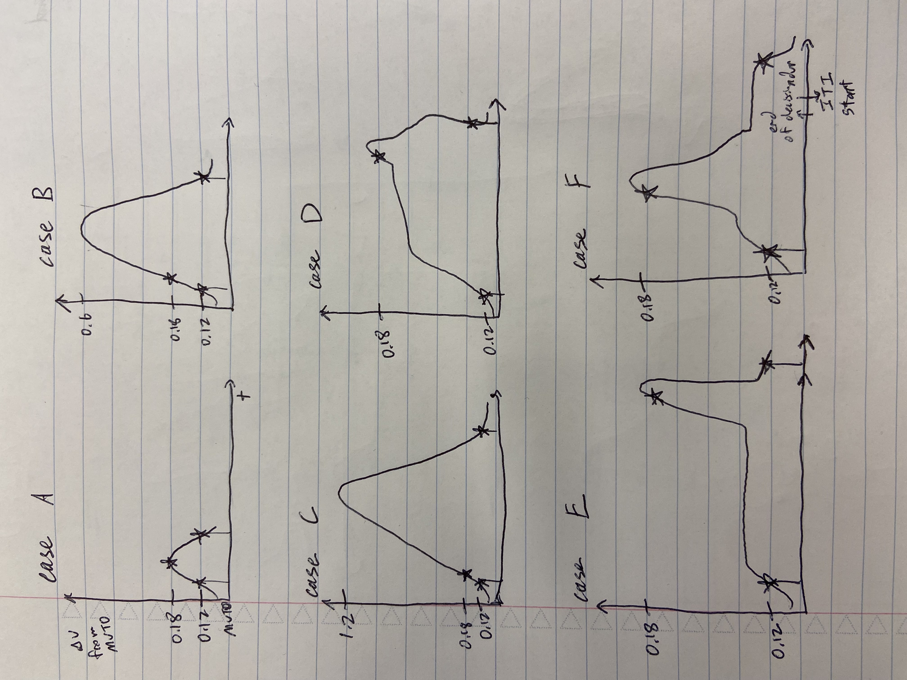

# PreprocessLeverData
The lever data, `lever_data`, only holds the raw lever Arduino values from Arduino's `readAnalog()` function, which scales 0-5V (the voltage range going into this pin) to numbers from 0-1023 (so at a resting neutral position, the lever is usually about 550 which anecdotally seems to match Vincent's calculated Voltage of about 2.6V). The Arduino encodes these numbers with values between 0-1023 into 2 bytes of data and sends them over to the computer via USB virtual serial port. The MATLAB program, leverIN_to_matlab.m then listens in and decodes this array of 2 bytes back into the number between 0-1023 and saves it into `lever_data`.

__Additional information on the sampling rate__: It's a more or less consistent sampling rate because the number of data bytes actually being sent through the USB virtual serial port is always exactly 2 bytes. Empirically, it varies, for the first few thousand entries it'll be a little faster ~100us, then for whatever reason it slows down to a more consistent pace of around 150-170us, probably due to hitting/overloading the serial port transfer buffer limit (in the Arduino code, there is no delay, it sends new data as soon as it has read it and reads new data as soon as it's done sending). Since it's so fast, but also empirically quite consistent after the first few thousand entries, I've decided to let go of trying to get it at an exactly even sampling rate since I believe at these several kHz frequencies, the actual animal movements will be approximated closely enough for analysis and comparisons. Plus, sending additional bytes of information (e.g. exact time) through the USB serial port will only slow it down further.

Also, anytime a trial is not currently ongoing--which is when we are in the ITI--so when tStart == LOW or 0V is at the tStart pin (pin 11), `lever_data` will be >2000. First, we will align each trial's MATLAB starting time to each first value of `lever_data` that is not >2000. Dividing the total time between trial start times by the number of entries recorded in `lever_data` between those two points will give an estimate of the sampling frequency and the change in time, `dt`, between any two entries for that trial.

The sensor itself may have some noise above a cutoff frequency, `cutoff_frequency`, of 40 Hz and all relevant attributes of the animal's movement are below 40 Hz. We'll use a sharp 6th order Butterworth filter to filter this out.

Finally, we'll rescale everything from the 0-1023 Arduino values range back to the 0-5V range: $\text{data} \times \frac{5}{1023}$, and save it as `processed_lever_data`.

All data will be saved as .bin files in case I need to go back to C++ in a folder specified by `output_folder`

## This book analyzes 1 day session.

## Requires:
- ToneDisc matfile
- LeverData matfile

## Outputs to folder:
- trial#.bin files as the raw `lever_data` Arduino values
- filtered_trial#.bin files as the low-pass Butterworth filtered Arduino values
- processed_trial#.bin files as the converted voltage values of lever data

## Internal modules:

### leverData2binary
Make binary files for each trial from the LeverData matfile
- opens and reads in the corresponding .mat file
- extracts the `lever_data` variable and puts into a C++ vector<double>
- remove unused empty rows of zeroes (`lever_data` is initialized in ../behavior/leverIN_to_matlab.m to hold up to 2 hours worth of data, but the unused values are just 0s)
- extracts each individual trial+subsequent ITI of the `lever_data` and re-lowers the ITI values back down to 0-1023 instead of 2000-2023
- save each trial+ITI chunk of `lever_data` to its own .bin file

arguments:
- char* output_folder = the output folder where the binaries will be saved e.g. ./Data/AnB1/B1_20231030/
- char* matlab_filename = the lever data .mat filename e.g. ./Data/AnB1/B1_20231030.mat
- int beginning_samples_to_skip = number of beginning samples to skip

Example syntax: ./0a_main ./Data/AnB1/B1_20231030/ ./Data/AnB1/B1_20231030.mat 15460

To compile on Mac M1 with libmatio installed via homebrew: `!g++ -I/opt/homebrew/opt/libmatio/include/ -L/opt/homebrew/Cellar/libmatio/1.5.24/lib/ -o leverData2binary leverData2binary.cpp -lmatio`

# PreprocessDataArduino
This is just a histogram of the previous old `dataArduino`'s sampling rate, as defined by the difference between MATLAB times between every two consecutive samples.

This `dataArduino` only adds samples in between running sections of the trial code throughout the main MATLAB ToneDiscriminationV3_GF.m code, leading to very uneven sampling, and it also sends several other bytes of irrelevant information each time (e.g. empty left and right lickspout detection data) which further slows it down.

## Not used in main analysis anymore.

# HitMovements
I will define a `movement` as the recorded lever movement between a defined first to second threshold and back for the third threshold. This notebook is solely for detecting and saving each movement from a day.

__Note on possible movements:__

This image lists some of the possible cases that could occur with movement. For our analysis, all of these movements will count. The first, second, and third thresholds are marked with stars, and the beginning of the movement window and ending of the movement window are marked with vertical lines.

The folder defined by `analysis0_folder` needs contain the processed `lever_data` as processed_lever_data_trial#.bin binary files. The extracted hit movements will have MVT0 subtracted off and be temporally aligned to be comparable. They will be saved to a movement_trial#.npy file also in the folder defined by `output_folder`. From this point forward, I'm using `np.save()` to save all analysis as 2D arrays since I'm assuming I don't need to reaccess or further process the entire giant data with C++ anymore.

## This notebook analyzes 1 day session.

## Requires:
- ToneDisc matfile
- **PreprocessLeverData** output

## Outputs to folder:
- movement_trial#.npy for each extracted hit movement
- buffered_movement_trial#.npy for each extracted hit movement with a 300 sample buffer on either side

# Path
There are two parts to how a movement between point A and point B might vary. The first is variance in the actual movement path taken to get from point A to point B, and the second is the speed of the movement. Here, I'll analyze the movement path variance, `var_p`, across all __Hit__ trials that successfully have movement from the first threshold to the second threshold and back to the first threshold (this back threshold will effectively be a third threshold) from 1 day (and ignore variance in speed for now).

Then the movements will be scaled across % completion of their entire movement path. This percent completion movement will be saved again in `output_folder` as a movement_percent_scaled_trial#.npy file.

I will then plot the variance of this path, `var_p`, over the % movement completion between the first to second to third threshold. I also calculate the average movement path, `mean_p`, for __Hit__ trials that had movement from the first to second to third threshold for this 1 day. Finally, I will save `var_p` and `mean_p` to .npy files.

## This book analyzes 1 day session.

## Requires:
- **HitMovements** outputs

## Outputs to folder:
- movement_percent_scaled.npy of the movement data scaled between 0 and 100%
- mean_p.npy of E[paths]
- var_p.npy of Var[paths]
- num_movements.npy an integer of the number of movements extracted

# CumulativePathVariance
To compare the movement path variance, `var_p`, across days, I calculate the cumulative movement path variance, `cumuative_var_p`, as the sum of the variance across 100% of the movement: $\int\limits_{0}^{100} Var_p(p) dp$ where $p =$ % movement completed. Then, I plot the cumulative movement path variance for each day.

### This book analyzes all sessions for an animal.

### Requires:
- **Path** outputs for all sessions for an animal

### Outputs to folder:
- cumulative_var_ps.npy the cumulative Var[paths] for each day

# Speed
As previously explained, there are two parts to how a movement between point A and point B might vary. The second part is the speed of the movement. Here, I calculate the average speed, `s`, of each __Hit__ trial's movement, defined as $\frac{100}{\text{time}}$ in units of % movement/s. I then find the mean of these average speeds, `mean_s`, and variance of these average speeds, `var_s`, across all trials for the day.

### This book analyzes all sessions for an animal.

### Requires:
- **HitMovements** outputs for all sessions for an animal

### Outputs to folder:
- mean_ss.npy the mean speed of movement completion across days
- var_ss.npy the Var[speed] of movement completion across days

# Velocity
Find the velocity path of movements. Velocity is calculated as the difference of consecutive points with a moving average filter of about 5 ms (29 samples).

__cutoff frequency of a moving average filter__:
for a moving average filter, $H(w) = \frac{1}{N} | \frac{\sin(wN/2)}{\sin(w/2)} | =0.5= -3 \text{dB}$

where $w = 2\pi \frac{f_\text{cutoff}}{f_\text{sample}}$ and $N=$ num samples per window

This analysis requires 7.5ms before the actual movement to find the moving average. We are assuming reaction time after tone is always more than 7.5 ms.

## This notebook analyzes 1 day session.

## Requires:
- ToneDisc matfile
- **PreprocessLeverData** output (for trial frequencies)
- **HitMovements** output

## Outputs to folder:
- movement_trial#.npy for each extracted hit movement
- buffered_velocity_trial#.npy for each extracted hit movement with a 300 sample buffer on either side
